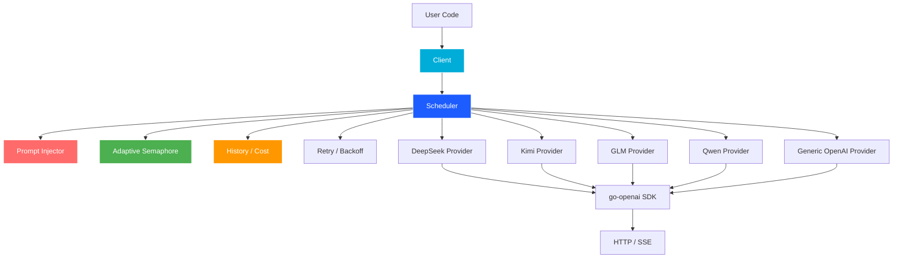

<div align="center">

# ⚡ AoEo

**Aggregated AI Provider SDK for Go**

[](https://golang.org)
[](./aoeo_test.go)
[](./)
[](./LICENSE)
[](https://deepseek.com)
[](https://moonshot.cn)

> *生产级多模型聚合调度 SDK —— 用 10 行代码获得高可用 LLM 调用能力*

[快速开始](#-快速开始) · [功能特性](#-功能特性) · [架构设计](#-架构设计) · [集成指南](INTEGRATION.md) · [API 文档](DESIGN.md)

</div>

---

## 📋 目录

- [✨ 功能特性](#-功能特性)
- [🚀 快速开始](#-快速开始)
- [📦 安装](#-安装)
- [🔧 核心功能](#-核心功能)
  - [基础调用](#1-基础调用--primary-provider)
  - [自动降级](#2-自动降级--fallback)
  - [双模型验证](#3-双模型验证--dual)
  - [流式响应](#4-流式响应--streaming)
  - [审计模式](#5-审计模式--audit)
  - [Prompt 注入](#6-prompt-注入)
  - [计费统计](#7-计费统计)
  - [事件系统](#8-事件系统)
  - [优雅关闭](#9-优雅关闭)
- [⚙️ 配置选项](#️-配置选项)
- [🏗️ 架构设计](#️-架构设计)
- [📊 生产部署建议](#-生产部署建议)
- [📁 示例代码](#-示例代码)
- [🗺️ 路线图](#️-路线图)
- [📄 许可证](#-许可证)

---

## ✨ 功能特性

<table>
<tr>
<td width="50%">

### 🔀 调度层
- **🔄 多 Provider 聚合** — DeepSeek / Kimi / GLM / Qwen / 任意 OpenAI-compatible API
- **⚡ 自动 Fallback** — 主 Provider 失败时自动切换备用
- **🎯 Round-Robin 负载均衡** — Dual / Audit 模式下的智能分发
- **🔒 自适应并发限流** — FIFO 信号量，防止配额耗尽

</td>
<td width="50%">

### 🛡️ 可靠性
- **🛡️ 熔断器 (Circuit Breaker)** — 连续 3 次失败 → 60s 自动冷却
- **🔄 指数退避重试** — 智能识别可重试错误
- **🧹 优雅关闭** — `Close()` 安全释放资源，拒绝新请求
- **💥 Panic 恢复** — 所有 Provider 调用均带 defer recover

</td>
</tr>
<tr>
<td width="50%">

### 📡 高级调用模式
- **📡 SSE 流式支持** — 原生 Streaming，逐字返回
- **📊 双模型验证** — 并发调用两个 Provider，Consensus 判断一致性
- **🔍 审计模式** — 串行交叉验证，自动降级
- **🌡️ 温度兼容性** — Kimi `kimi-k2.6` 自动重试（temperature 适配）

</td>
<td width="50%">

### 📈 可观测性
- **💰 自动计费统计** — Token 用量 × 单价 = 实时成本
- **💉 Prompt 注入** — 通配匹配 + 变量替换，零业务侵入
- **📊 调用历史** — Ring buffer 记录，按标签/Provider 过滤
- **📡 事件系统** — Provider 失败/恢复/Fallback/Audit 分歧事件
- **📝 结构化日志** — `log/slog` JSON 输出

</td>
</tr>
</table>

---

## 🚀 快速开始

```go
package main

import (
	"context"
	"fmt"
	"log"
	"os"

	aoeo "github.com/JishiTeam-J1wa/AoEo"
)

func main() {
	client, err := aoeo.NewClient(aoeo.Config{
		Providers: []aoeo.ProviderConfig{
			{
				Name:     "deepseek",
				APIKey:   os.Getenv("DEEPSEEK_API_KEY"),
				Endpoint: "https://api.deepseek.com",
				Model:    "deepseek-v4-pro",
			},
		},
	})
	if err != nil {
		log.Fatal(err)
	}
	defer client.Close()

	resp, err := client.ChatComplete(context.Background(),
		aoeo.BuildRequest(
			[]aoeo.Message{{Role: "user", Content: "Hello, world!"}},
			aoeo.WithTemperature(0.7),
		),
	)
	if err != nil {
		log.Fatal(err)
	}

	fmt.Println(resp.Choices[0].Message.Content)
	fmt.Printf("Cost: %.4f CNY\n",
		resp.Usage.Cost(aoeo.DefaultPricing("deepseek", "deepseek-v4-pro")))
}
```

<details>
<summary>💡 点击查看更多运行方式</summary>

```bash
# 1. 运行基础示例
cd examples/basic
go run main.go

# 2. 运行多 Provider + Fallback + Dual
cd examples/multi_provider
go run main.go

# 3. 运行 SSE 流式示例
cd examples/streaming
go run main.go
```

</details>

---

## 📦 安装

```bash
go get github.com/JishiTeam-J1wa/AoEo
```

**Go 版本要求**: ≥ 1.22

---

## 🔧 核心功能

### 1. 基础调用 — Primary Provider

始终使用配置列表中第一个可用的 Provider：

```go
resp, err := client.ChatComplete(ctx, req)
if err != nil {
    log.Fatal(err)
}
fmt.Println(resp.Choices[0].Message.Content)
fmt.Printf("Usage: prompt=%d completion=%d total=%d\n",
    resp.Usage.PromptTokens,
    resp.Usage.CompletionTokens,
    resp.Usage.TotalTokens)
```

---

### 2. 自动降级 — Fallback

主 Provider 失败后自动尝试下一个，直到成功或全部失败：

```go
resp, err := client.ChatCompleteWithFallback(ctx, req)
if err != nil {
    log.Fatal(err)
}
fmt.Printf("Response from: %s\n", resp.Model)
```

> 💡 **最佳实践**: 生产环境建议始终使用 `ChatCompleteWithFallback`，确保高可用性。

---

### 3. 双模型验证 — Dual

同时发给两个不同 Provider，返回两者结果 + 一致性判断：

```go
dual, err := client.ChatCompleteDual(ctx, req)
if err != nil {
    log.Fatal(err)
}

fmt.Printf("Consensus: %v\n", dual.Consensus)
if dual.Result1 != nil {
    fmt.Println("Provider 1:", dual.Result1.Choices[0].Message.Content)
}
if dual.Result2 != nil {
    fmt.Println("Provider 2:", dual.Result2.Choices[0].Message.Content)
}
```

---

### 4. 流式响应 — Streaming

```go
stream, err := client.ChatCompleteStream(ctx, req)
if err != nil {
    log.Fatal(err)
}

fmt.Print("[Streaming] ")
for chunk := range stream {
    if chunk.Err != nil {
        log.Printf("\n[Stream Error: %v]\n", chunk.Err)
        break
    }
    if chunk.Chunk.FinishReason != "" {
        fmt.Printf("\n[Finish: %s]\n", chunk.Chunk.FinishReason)
        break
    }
    fmt.Print(chunk.Chunk.Delta.Content)
}
```

> ⚠️ **注意**: 消费端提前退出时，应同时 `cancel()` context 以确保 goroutine 正确退出。

---

### 5. 审计模式 — Audit

先调用 Primary，再用另一个 Provider 验证结果：

```go
result, err := client.Audit(ctx, req)
if err != nil {
    log.Fatal(err)
}

fmt.Printf("Consensus: %v\n", result.Consensus)
fmt.Println("Primary:", result.Primary.Choices[0].Message.Content)
if result.Audit != nil {
    fmt.Println("Audit  :", result.Audit.Choices[0].Message.Content)
}
if !result.Consensus {
    fmt.Println("⚠️ 结果不一致，建议人工复核")
}
```

---

### 6. Prompt 注入

#### 全局 System Prompt 注入

```go
client, _ := aoeo.NewClient(cfg,
    aoeo.WithSystemPromptInjector(
        "You are a helpful assistant. Current date: {{date}}.",
        map[string]string{"date": time.Now().Format("2006-01-02")},
    ),
)
```

#### 按 Provider/Model 匹配注入

```go
pi := aoeo.NewPromptInjector()

// DeepSeek 专用系统提示
pi.AddTemplate(aoeo.PromptTemplate{
    Provider: "deepseek",
    Model:    "*",
    Position: "system",
    Content:  "You are DeepSeek, specialized in coding.",
})

// Kimi 专用前置任务标记
pi.AddTemplate(aoeo.PromptTemplate{
    Provider: "kimi",
    Model:    "kimi-k2.6",
    Position: "prepend_user",
    Content:  "[Task: {{task}}]",
    Vars:     map[string]string{"task": "creative-writing"},
})

client, _ := aoeo.NewClient(cfg, aoeo.WithPromptInjector(pi))
```

**注入位置**：

| 位置 | 说明 |
|---|---|
| `"system"` | 替换/添加 system 消息 |
| `"prepend_user"` | 在第一条 user 消息前插入 |
| `"append_user"` | 在最后一条 user 消息后追加 |

**通配匹配**: `Provider: "*"` 或 `Model: "*"` 匹配全部。

---

### 7. 计费统计

#### 配置价格

```go
cfg := aoeo.Config{
    Providers: []aoeo.ProviderConfig{
        {
            Name:     "deepseek",
            APIKey:   "sk-xxx",
            Endpoint: "https://api.deepseek.com",
            Model:    "deepseek-v4-pro",
            Pricing: aoeo.Pricing{
                PromptPer1K:     2.0,  // 每 1K prompt tokens 2元
                CompletionPer1K: 8.0,  // 每 1K completion tokens 8元
                Currency:        "CNY",
            },
        },
    },
}
```

#### 实时成本查询

```go
resp, _ := client.ChatComplete(ctx, req)
fmt.Println(resp.Usage.CostString(cfg.Providers[0].Pricing))
// 输出: 0.380000 CNY
```

#### 聚合统计

```go
stats := client.Stats()
for name, s := range stats {
    fmt.Printf("%s: %d calls, %.4f %s total, %.1fms avg, %d failed\n",
        name, s.TotalCalls, s.TotalCost, s.Currency,
        float64(s.AvgLatencyMs), s.FailedCalls)
}
```

#### 按标签过滤历史

```go
// 调用时打标签
req.Tags = []string{"production", "v2-prompt"}
resp, _ := client.ChatComplete(ctx, req)

// 后续查询
for _, r := range client.History().RecordsByTag("production") {
    fmt.Printf("%s: %dms, cost=%.4f\n", r.Provider, r.LatencyMs, r.Cost)
}
```

---

### 8. 事件系统

```go
type MyEmitter struct{}

func (e *MyEmitter) Emit(topic string, data ...any) {
    switch topic {
    case aoeo.EventProviderFail:
        fmt.Printf("❌ Provider %s failed (count=%d)\n", data[0], data[1])
    case aoeo.EventProviderOpen:
        fmt.Printf("🔒 Provider %s circuit breaker OPEN\n", data[0])
    case aoeo.EventProviderRecover:
        fmt.Printf("✅ Provider %s recovered\n", data[0])
    case aoeo.EventFallbackTrigger:
        fmt.Printf("🔄 Fallback triggered: %s\n", data[0])
    case aoeo.EventAuditDisagree:
        fmt.Printf("⚠️  Audit disagreement: %s\n", data[0])
    }
}

client.SetEmitter(&MyEmitter{})
```

---

### 9. 优雅关闭

```go
// 安全关闭，拒绝新请求
if err := client.Close(); err != nil {
    log.Printf("Close error: %v", err)
}

// 关闭后所有调用返回错误
_, err := client.ChatComplete(ctx, req)
// err: "scheduler is closed"
```

> 💡 **最佳实践**: 始终 `defer client.Close()` 或在应用退出信号中调用。

---

## ⚙️ 配置选项

```go
client, _ := aoeo.NewClient(cfg,
    aoeo.WithTimeout(60*time.Second),           // 单次请求超时
    aoeo.WithHistory(aoeo.NewHistory(1000)),    // 历史记录
    aoeo.WithRetry(aoeo.RetryConfig{             // 重试策略
        MaxRetries: 3,
        BaseDelay:  500 * time.Millisecond,
        MaxDelay:   10 * time.Second,
        Multiplier: 2.0,
    }),
    aoeo.WithPromptInjector(pi),                 // Prompt 注入
)
```

---

## 🏗️ 架构设计



---

## 📊 支持的 Provider

| Provider | 内置工厂 | 默认端点 | 默认模型 | 内置价格 |
|---|---|---|---|---|
| **DeepSeek** | `aoeo.NewDeepSeekProvider()` | `https://api.deepseek.com` | `deepseek-v4-pro` | 2/8 CNY |
| **Kimi (Moonshot)** | `aoeo.NewKimiProvider()` | `https://api.moonshot.cn/v1` | `kimi-k2.6` | 3/12 CNY |
| **GLM (智谱)** | `aoeo.NewGLMProvider()` | `https://open.bigmodel.cn/api/paas/v4` | `glm-5.1` | 5/5 CNY |
| **Qwen (通义)** | `aoeo.NewQwenProvider()` | `https://dashscope.aliyuncs.com/compatible-mode/v1` | `qwen3.7-max` | 5/10 CNY |
| **Claude / OpenAI / 任意兼容** | `aoeo.NewOpenAIProvider()` | `https://api.openai.com/v1` | *(从配置)* | *(自定义)* |

> 💡 任何支持 OpenAI Chat Completions 协议的 API 都可以通过 `NewOpenAIProvider()` 接入。

---

## 📊 生产部署建议

### 1️⃣ 环境变量管理 API Key

**永远不要**在代码中硬编码 API Key：

```go
apiKey := os.Getenv("DEEPSEEK_API_KEY")
if apiKey == "" {
    log.Fatal("DEEPSEEK_API_KEY not set")
}
```

### 2️⃣ 设置合理的并发上限

```go
ProviderConfig{
    Name:          "deepseek",
    MaxConcurrent: 5,  // 根据平台 RPM/TPM 限制调整
}
```

### 3️⃣ 启用历史记录用于监控

```go
hist := aoeo.NewHistory(10000)  // 保留最近 10000 条记录
client, _ := aoeo.NewClient(cfg, aoeo.WithHistory(hist))

// 定期导出统计
ticker := time.NewTicker(1 * time.Minute)
for range ticker.C {
    for name, s := range client.Stats() {
        metrics.Record("aoeo.calls", s.TotalCalls, "provider", name)
        metrics.Record("aoeo.cost", s.TotalCost, "provider", name)
    }
}
```

### 4️⃣ 处理 Stream 消费者的提前退出

调用方如果提前 `break` 或 `return`，应同时 `cancel` ctx 以确保 goroutine 正确退出：

```go
ctx, cancel := context.WithCancel(context.Background())
defer cancel()

stream, _ := client.ChatCompleteStream(ctx, req)
for chunk := range stream {
    if someCondition {
        cancel() // 确保内部 goroutine 收到退出信号
        break
    }
}
```

### 5️⃣ 自定义 Logger

```go
logger := slog.New(slog.NewJSONHandler(os.Stdout, &slog.HandlerOptions{
    Level: slog.LevelWarn,
}))
aoeo.SetLogger(logger)
```

---

## 📁 示例代码

见 [`examples/`](examples/) 目录：

| 示例 | 说明 |
|---|---|
| [`basic/`](examples/basic/) | 单 Provider 基础调用 + 成本输出 |
| [`multi_provider/`](examples/multi_provider/) | 多 Provider + Fallback + Dual + Stats |
| [`streaming/`](examples/streaming/) | SSE 流式响应 |
| [`list_models/`](examples/list_models/) | 模型列表查询 + 连通性测试 |

---

## 🗺️ 路线图

### ✅ Phase 1 — 核心调度
- [x] 统一 Provider 接口
- [x] 4 大内置 Provider + Generic OpenAI
- [x] 熔断器 + 自适应并发限流
- [x] Fallback + Dual + Audit
- [x] 模型列表查询 + 连通性测试
- [x] SSE 流式支持

### ✅ Phase 2 — 生产增强
- [x] 指数退避重试
- [x] Token 用量追踪与成本估算
- [x] Prompt 注入系统（通配匹配 + 变量替换）
- [x] 结构化日志（`log/slog`）
- [x] 优雅关闭（Graceful Shutdown）

### 🔮 Phase 3 — 生态扩展
- [ ] 权重路由（按价格/延迟/质量加权）
- [ ] Provider 主动健康检查心跳
- [ ] Function Calling 抽象层
- [ ] CLI 工具（`aoeo list-models`, `aoeo test`）

---

## 📄 许可证

[MIT License](LICENSE) © JishiTeam J1wa

> **AoEo** 这个名字来源于 *"Aggregation of Everything Open"*，寓意聚合一切 OpenAI-compatible 的模型服务。
